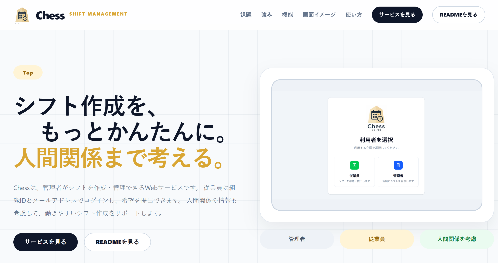
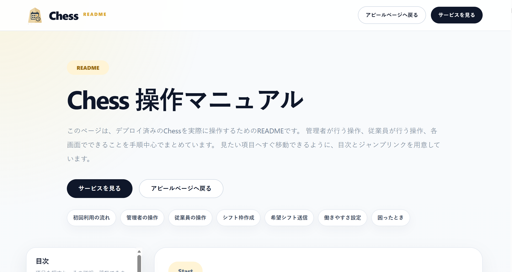

# Chess アピールサイト｜配置・確認手順

Chessの特徴と操作方法を紹介する、HTML・CSS・JavaScriptだけで作成した静的サイトです。
ReactやNext.jsを使用していないため、フォルダ内のファイルをそのまま静的サイトとして配置できます。

## 完成画面

### 1. アピールページ

サイトを開いたとき、最初に表示されるページです。
Chessの特徴、機能、画面イメージ、利用の流れを確認できます。



主なボタン：

- **サービスを見る**：デプロイ済みのChessを開きます。
- **READMEを見る**：操作マニュアルページを開きます。
- ヘッダーの「課題」「強み」「機能」など：アピールページ内の該当項目へ移動します。

### 2. README・操作マニュアルページ

管理者と従業員の操作方法を、項目ごとに確認できるページです。



主な機能：

- 左側の目次から、確認したい操作へ移動できます。
- スクロールすると、現在読んでいる項目が目次上で強調表示されます。
- スマートフォンでは右上のハンバーガーボタンから目次を開閉できます。
- **アピールページへ戻る**で最初のページへ戻ります。
- **サービスを見る**でデプロイ済みのChessを開きます。

## ページの移動関係

```text
index.html（アピールページ）
├─ サービスを見る ──────> https://chess-nine-xi.vercel.app/
└─ READMEを見る ────────> readme.html
                              ├─ アピールページへ戻る ─> index.html
                              └─ サービスを見る ──────> デプロイ済みChess
```

## ファイル構成

```text
Chess_Appeal_site/
├─ index.html
│  └─ Chessの特徴を紹介するアピールページ
├─ readme.html
│  └─ 管理者・従業員向けの操作マニュアル
├─ style.css
│  └─ ページ全体とスマートフォン表示のデザイン
├─ script.js
│  └─ アピールページのスマートフォンメニュー処理
├─ README_配置手順.md
│  └─ この説明書
└─ assets/
   └─ screenshots/
      ├─ homepage-start.png
      ├─ homepage-readme.png
      └─ サイト内で使用する各画面の画像
```

## VS Codeで確認する方法

### Live Serverを使用する場合

1. VS Codeで`Chess_Appeal_site`フォルダを開きます。
2. `index.html`を選択します。
3. 右クリックして、**Open with Live Server**を選択します。
4. ブラウザにアピールページが表示されます。
5. **READMEを見る**を押して、操作マニュアルページへの移動を確認します。

Live Serverが入っていない場合は、VS Codeの拡張機能画面から「Live Server」をインストールしてください。

### Markdown内の画像を確認する場合

1. VS Codeで`README_配置手順.md`を開きます。
2. `Ctrl + Shift + V`を押します。
3. Markdownプレビューに、上記2枚の完成画面が表示されます。

## 配置するときの注意

`index.html`だけではなく、次のファイルとフォルダを同じ構成のまま配置してください。

- `index.html`
- `readme.html`
- `style.css`
- `script.js`
- `assets`フォルダ

ファイル名やフォルダ名を変更すると、CSS、JavaScript、画像へのリンクが切れる場合があります。

## 配置後の確認項目

- [ ] `index.html`が最初に表示される
- [ ] ロゴと各スクリーンショットが表示される
- [ ] **サービスを見る**でChessが開く
- [ ] **READMEを見る**で`readme.html`が開く
- [ ] READMEの目次から各項目へ移動できる
- [ ] スマートフォンでハンバーガーメニューを開閉できる
- [ ] スマートフォンで横方向にはみ出していない
- [ ] READMEからアピールページへ戻れる

## リンク先

- デプロイ済みChess：<https://chess-nine-xi.vercel.app/>
- アピールページ：`index.html`
- 操作マニュアル：`readme.html`
